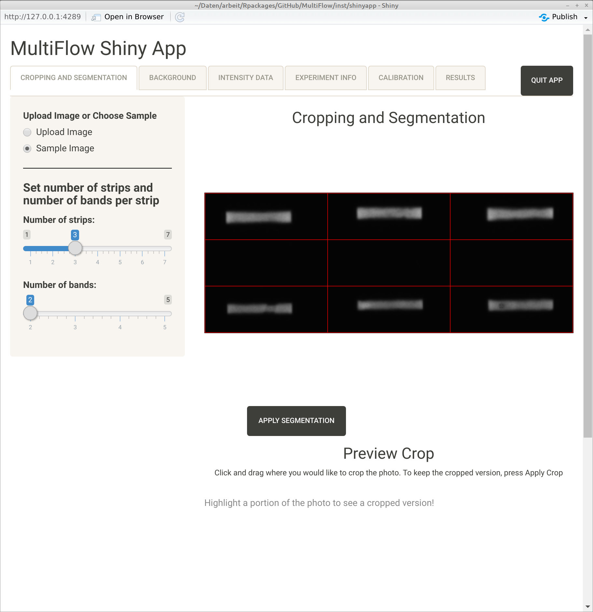

# MultiFlow
The repository includes the development version of R package MultiFlow

[](https://www.gnu.org/licenses/lgpl-3.0)
[](https://www.repostatus.org/#active)

## Installation

At the moment a patched version of package ShinyImage is required, which 
can be obtained from me on request.

```{r, eval = FALSE}
# install.packages("remotes")
remotes::install_github("stamats/MultiFlow", build_vignettes = TRUE)
```

## Start App

```{r}
MultiFlow::runMultiFlowApp()
```


## Open User's Guide

```{r}
vignette("MultiFlow")
```

See also: [MultiFlow User's Guide](https://stamats.github.io/MultiFlow/MultiFlow.html).


## Description
Image analysis (cropping, segmetation, thresholding, feature engineering) 
of images taken from lateral flow assays, computation of linear calibration 
models, automatic report generation via rmarkdown by means of a shiny app.


