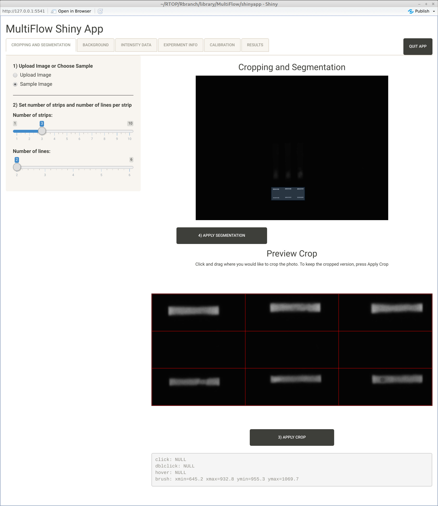
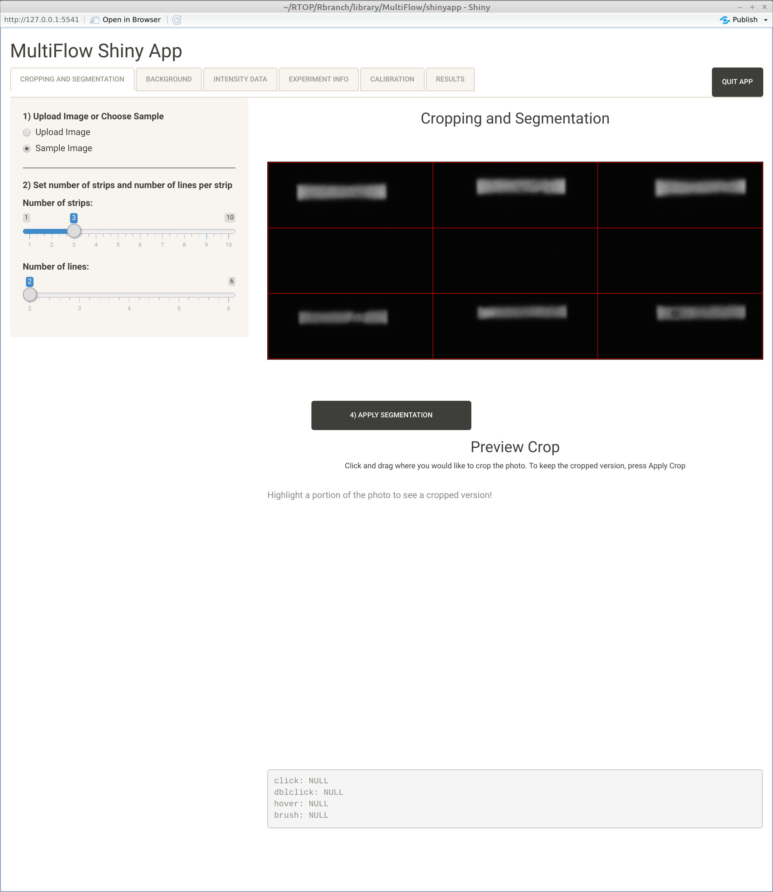
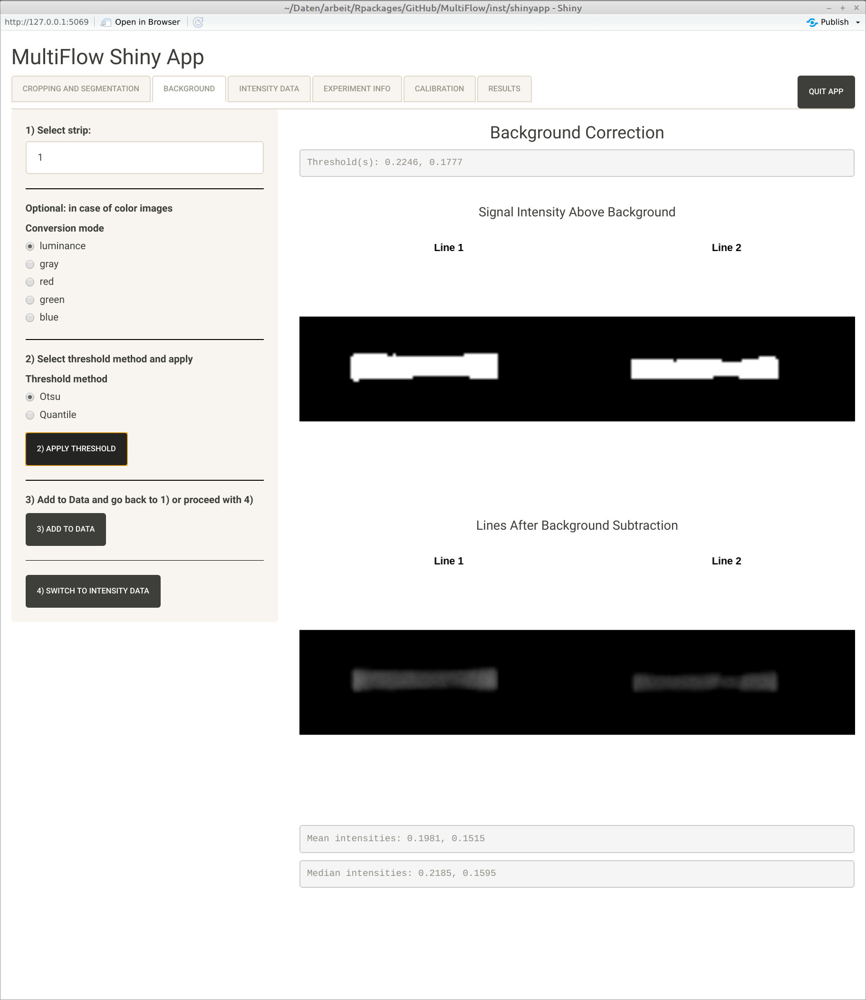
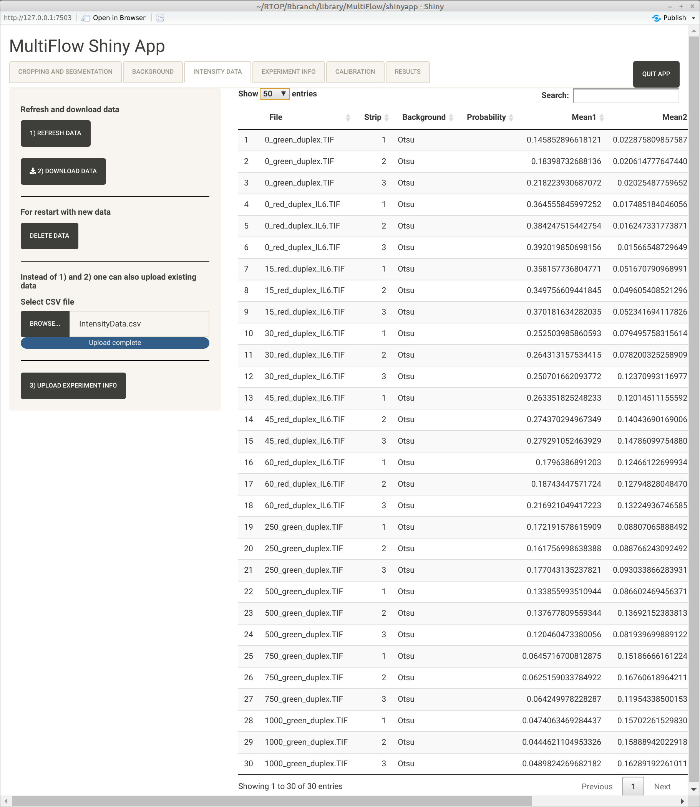
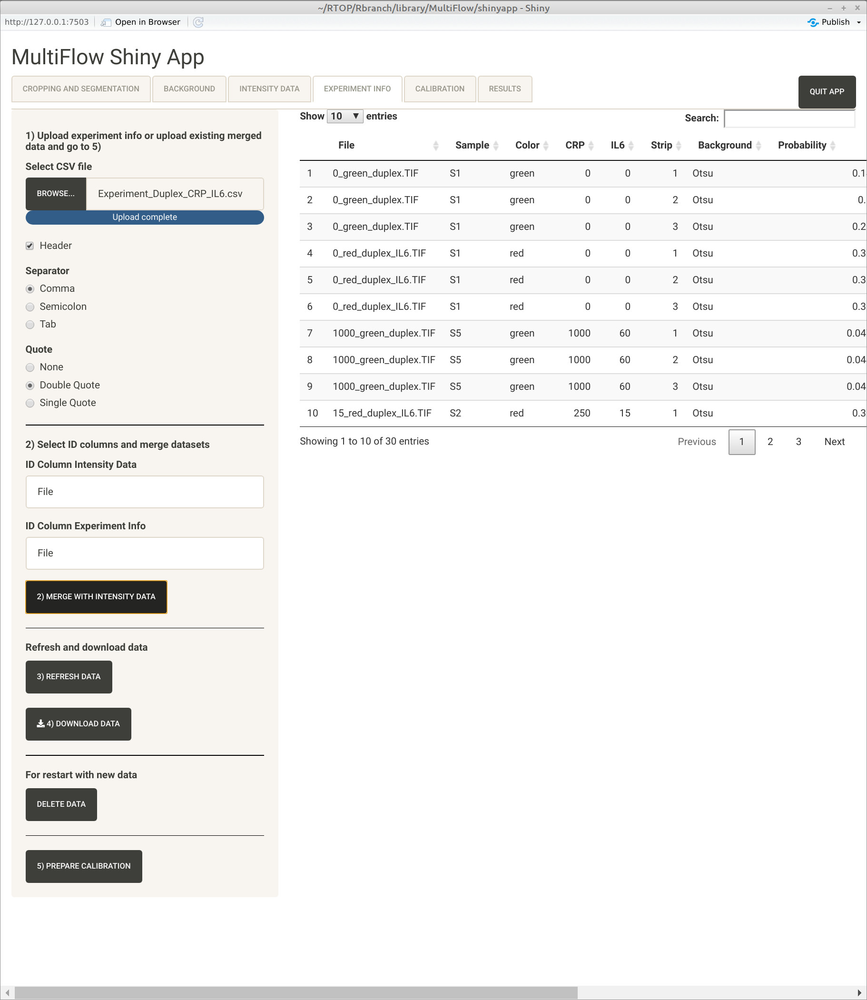
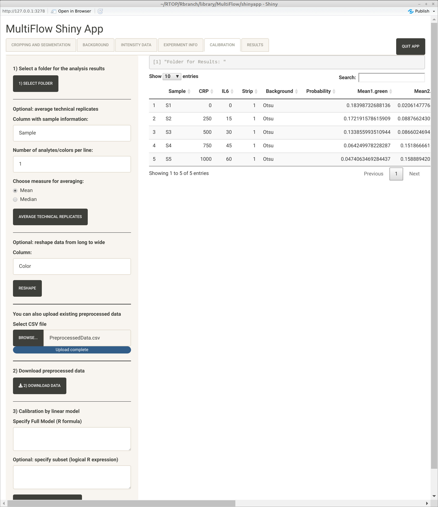
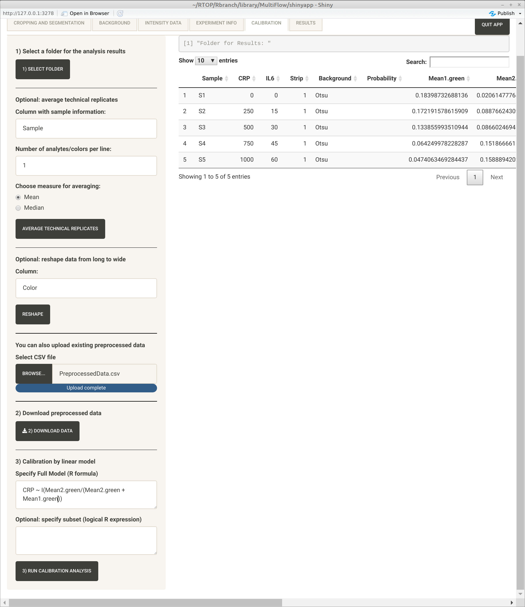
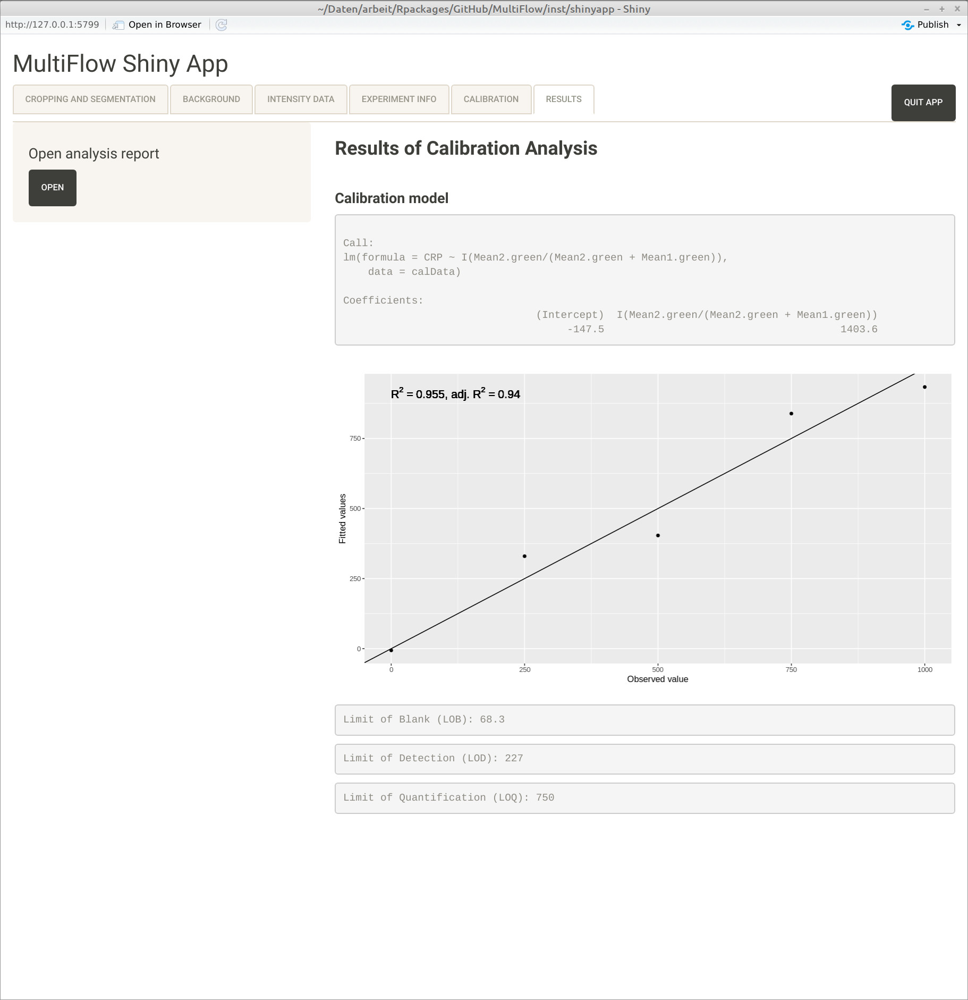
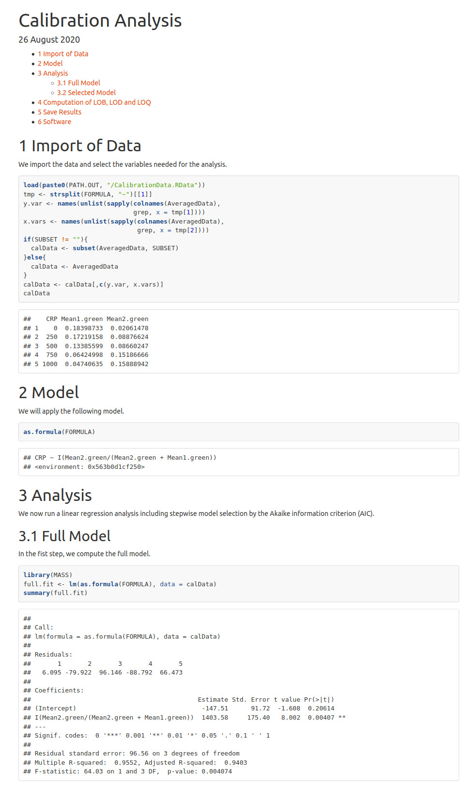

# Introduction
The MultiFlow shiny app [@shiny] can be used to analyse images of lateral flow 
assays and to calculate intensity values for the lines of the photographed 
strips. The intensity values can be merged with information about the experiment 
and preprocessed by averaging technical replicates. Finally, one can perform a 
calibration analysis for the data by arbitrary linear models.

In addition to starting with the images, the app also offers further options. 
One can also start with intensity data on Tab 3, with merged data (intensity 
data merged with experiment information) on Tab 4, or with preprocessed 
data on Tab 5.

# Tab 1: Cropping and Segmentation

## 1) Upload Image or Choose Sample

The first step consists of loading an image of one or several lateral flow strips. 
For trying out the app one can also load a sample image provided with the package.
For the purpose of demonstration we use the sample image provided with the 
package.

## 2) Set number of strips and number of lines per strip

In the second step, one needs to select the number of strips shown in the image
and the number of lines per strip.

The maximum number of strips per image is 10, but in principle could be extended
to a higher number. The only requirements is that the strips are regularly spaced
with identical or at least similar spaces between them and between the lines. 
The minimum number of lines per strip is two, the maximum number of lines per 
strip is six since we are not aware of any lateral flow assay having more than 
six lines.

## 3) Apply Crop

After loading the image and selecting the number must strips as well as lines
per strip, the image must be cropped as shown in the following screenshot.

{width=100%}

Clicking "3) APPLY CROP" selects the cropped region as can be seen in the 
screenshot below.

{width=100%}

The cropping was adapted from the shiny app provided by package ShinyImage 
[@ShinyImage].

## 4) Segmentation

Clicking "4) APPLY SEGMENTATION" segments the image and changes to the second
tab. The segments between the bands are used in our quantile background 
correction method; see below.

# Tab 2: Background

## 1) Select Strip

If there is more than one strip on the analysed image, one first needs to select,
which strip shall be analysed.

## Optional: in case of color images

If the image is a color image, it will be transformed to grayscale. By default,
we apply the luminance approach, which converts color to grayscale preserving
luminance; that is, the gayscale values is obtained by 

$$
  0.2126 * R + 0.7152 * G + 0.0722 * B
$$
where R, G, B stands for the red, green and blue channel of the color image. 
By selecting "gray", the arithmetic mean of the RGB values is used. 
Furthermore, the selection of "red", "green" or "blue" allows a color channel
wise analysis of color images.

## 2) Select threshold method and apply

There are two threshold methods, where the default is Otsu's method [@Otsu1979].
Otsu's method returns a single intensity threshold that separates pixels into 
foreground and background. It is equivalent to k-means clustering of the 
intensity histogram [@Liu2009]. The quantile method is a simple method that 
computes the specified quantile of all pixel intensities of the segments 
lying between the lines (per strip). In most of the images we have analysed 
so far, Otsu's method performed very well and better than our quantile method. 
However, in cases where the lines are unsharp and very blurred our quantile 
method may outperform Otsu's method.

By clicking "2) APPLY TRESHOLD" the selected threshold method is applied to the 
segemented images of the selected strip. The result is shown in two ways. The
first row of images shows the pixels that have intensities above the background.
The second row of images shows the images after background subtraction; see
the screenshot below.

{width=100%}

## 3) Add to data and go back to 1) or proceed with 4)

Clicking "3) ADD TO DATA" adds the mean and median of the background subtracted
intensities of the pixels with intensities above the threshold to the data.
Now, one can proceed with the second strip of the image or go back to Tab 1 
and load the next image. When all strips and images are processed one can 
proceed with 4). 

## 4) Switch To Intensity Data

Clicking "4) SWITCH TO INTENSITY DATA" changes the Tab to Tab 3.

# Tab 3: Intensity Data

## Refresh and download data

The "REFRESH DATA" button is provided to make sure that the latest version of
the generated intensity data is shown in the Tab. By clicking "2) DOWNLOAD DATA" 
the data can be saved to a standard csv file. 

## For restart with new data

We also provide a "DELETE DATA" button for restarting with new images or uploading
an already existing dataset.

## Instead of 1) and 2) one can also upload existing data

Instead of generating new data, one can also upload already existing intensity
data, that may have been generated even with a different software. Hence, this
step could also be seen as a second entry point of our app. The screenshot below
shows an example of data that were generated with the app saved and then loaded
again.

{width=100%}

## 3) Upload Experiment Info

Clicking "3) UPLOAD EXPERIMENT INFO" changes the Tab to Tab 4, where information
about the experiment can be loaded.

## Tab 4: Experiment Info

## 1) Upload experiment Info or upload existing merged data and go to 5)

One first can either upload information about the experiment in form of a 
csv file or upload already merged data (intensity data merged with experiment
information). An example of a table with information about the experiment is
shown in the screenshot below.

{width=100%}

This is a third optional starting point of our app. That is, one can also 
directly start with already merged data and proceed with the calibration 
analysis.

## 2) Select ID columns and merge datasets

For merging the intensity data with the information about the experiment, one
has to specify the names of the columns on which the merge should take place. 
The default is "File", since a "File" column is generated when the intensity
data is computed with the app. By clicking "2) MERGE WITH INTENSITY DATA" the
two datasets will be merged. An example of a table with merged data is
shown in the screenshot below.

{width=100%}

## Refresh and download data

The merged data can be downloaded to a csv file by clicking "4) DOWNLOAD DATA",
where one can make sure that the app shows the most current version of the data
by clicking "3) REFRESH DATA".

## For restart with new data

We again provide a "DELETE DATA" button for restarting with new images, uploading
new intensity dara on Tab § or uploading an already existing merged dataset.

## 5) Prepare Calibration

Clicking "5) PREPARE CALIBRATION" changes the Tab to Tab 5, where the data 
can be further preprocessed ant the calibration analysis can be started.

# Tab 5: Calibration

## 1) You must first select a folder for the analysis results!

The first step is very important. If one forgets, to select a folder for the
analysis results before running the analysis, the app will crash. 

## Optional: average technical replicates

If the merged data includes technical replicates, these replicates can be 
averaged either by the arithmetic mean or the median. For this purpose the 
name of the column, which enables the identification of the replicates is 
required. By default we assume that this column is called "Sample". In case
there is more than one analyte/color per line, one can should set 
"Number of analytes/colors per line" to the respective number. If this number
is larger than 1, an additional field is shown, where one should enter the
name of the column including the analyte/color information.

## Optional: reshap data from long to wide

If there is more than one analyte/color per line, one might want to combine
both information into one calibration model. For such cases it is useful to
reshape the data from long (analyte/color data in the rows) to 
wide (analyte/color data in the columns).

## One can also upload existing preprocessed data.

Instead of generating the preprocessed data with our app, one can also upload
preprocessed data and perform the calibration analsis on them. An example
of uploaded preprocessed data that were generated with our app and saved to
a csv file is shown in the following screenshot.

{width=100%}

## 2) Download preprocessed data

By clicking "2) DOWNLOAD DATA", the preprocessed data can be downloaded to 
a csv file.

## 3) Clibration by linear model

In the final step of this Tab, one has to specify the calibration model. 
This model must be given as a valid R formula for a linear model that will be 
plugged into R function "lm", which will be applied to fit the respective 
linear regression model. If an invalid formula is provided, the app will
crash. An example is visible in the following screenshot.

{width=100%}

Sometimes one only wants to analyse a subset of the data. In such cases the
subset can be provided in terms of a logical R expression in the field below
"Optional: specify subset (logical R expression)". 

By pressing "3) RUN CALIBRATION ANALYSIS" the RData-file "CalibrationData.RData"
will be generated and saved in the specified analysis folder. Next, the rmarkdown
file "CalibrationAnalysis.Rmd" will be copied to the same folder and will be
rendered into file "CalibrationAnalysis.html" by using R package "rmarkdown"
[@rmarkdown]. The results of the calibration analysis will be saved in 
file "CalibrationResults.RData" and will be used to generated a brief overview
of the results that will be shown on Tab 6. All four files will remain in the
folder selected for the analysis results. That is, one may use and modify 
these files for an extended analysis.

# Tab 6: Results

The final Tab of our app shows a brief overview of the analysis results as 
shown in the following screenshot.

{width=100%}

## Open analysis report

By clicking "Open" the full report of the calibration analysis will be opened
in the standard browser. The first part of the report is visible in the following
screenshot.

{width=100%}

# Required R packages

Our app requires the following R packages to work properly:

* stats [@Rcore]
* shiny [@shiny]
* shinyjs [@shinyjs]
* shinythemes [@shinythemes]
* ShinyImage [@ShinyImage]
* fs [@fs]
* shinyFiles [@shinyFiles]
* Bioconductor package EBImage [@EBImage]
* DT [@DT]
* rmarkdown [@rmarkdown]
* ggplot2 [@ggplot2]

# References